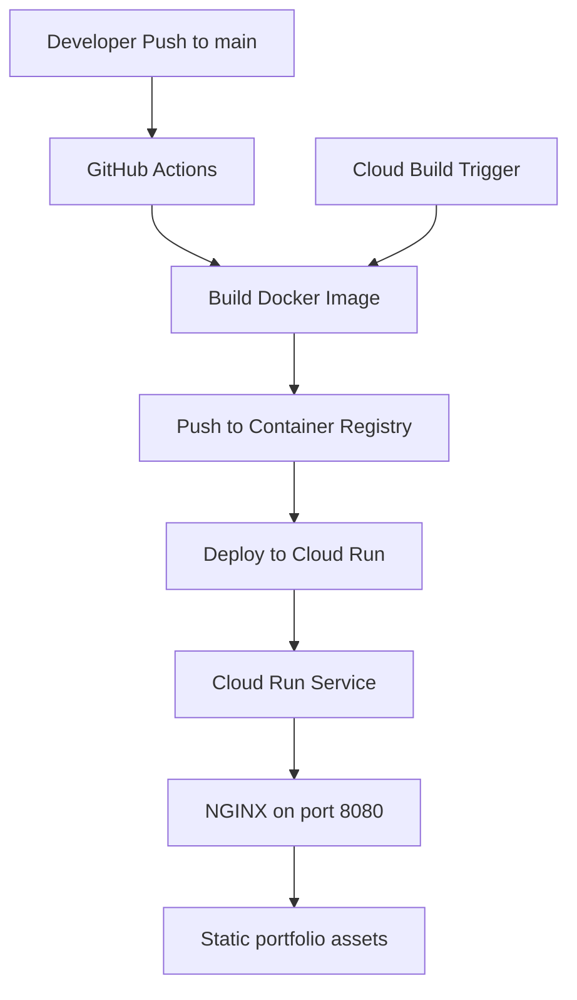

# Shasi-CaaS

Modern portfolio website for **Shasidhar Reddy Mallu**, built with pure HTML, CSS, and JavaScript and packaged for **Google Cloud Run** using **NGINX**.

## Highlights
- Modern dark UI inspired by premium tech/academy landing pages
- Terminal-style animated hero with typewriter effect
- Responsive single-page portfolio with smooth scroll and mobile navigation
- Scroll-triggered reveal animations and animated skill meters
- Production-ready Docker, NGINX, Cloud Build, Cloud Run, and GitHub Actions setup

## Project Structure
```text
Shasi-CaaS/
├── src/
│   ├── index.html
│   ├── Shasidhar-Reddy-Mallu-Resume.txt
│   ├── css/
│   │   └── style.css
│   ├── js/
│   │   └── main.js
│   └── images/
├── Dockerfile
├── .dockerignore
├── nginx.conf
├── clouddeploy/
│   ├── service.yaml
│   └── cloudbuild.yaml
├── .github/
│   └── workflows/
│       └── deploy.yml
└── README.md
```

## Architecture


## Local Development
### Option 1: Static preview
Open `src/index.html` directly in a browser, or serve the `src` folder with a local web server.

### Option 2: Docker
```bash
docker build -t shasi-portfolio .
docker run --rm -p 8080:8080 shasi-portfolio
```
Then visit `http://localhost:8080`.

## Docker Notes
- Multi-stage Dockerfile based on `node:20-alpine` and `nginx:1.25-alpine`
- Final image serves static files from `/usr/share/nginx/html`
- NGINX listens on **port 8080** for Cloud Run compatibility
- Compression, caching, SPA fallback, and security headers are enabled in `nginx.conf`

## Cloud Run Deployment
### Manual deployment with gcloud
```bash
gcloud config set project PROJECT_ID
gcloud builds submit --config clouddeploy/cloudbuild.yaml
```

### Direct deploy with Docker build
```bash
docker build -t gcr.io/PROJECT_ID/shasi-portfolio:latest .
docker push gcr.io/PROJECT_ID/shasi-portfolio:latest
gcloud run deploy shasi-portfolio   --image gcr.io/PROJECT_ID/shasi-portfolio:latest   --region us-central1   --platform managed   --allow-unauthenticated
```

### Service manifest
Update `PROJECT_ID` in `clouddeploy/service.yaml`, then apply as needed:
```bash
gcloud run services replace clouddeploy/service.yaml --region us-central1
```

## CI/CD Setup
### Cloud Build
`clouddeploy/cloudbuild.yaml` builds, tags, pushes, and deploys the image using `_REGION` substitution.

### GitHub Actions
`.github/workflows/deploy.yml` includes a placeholder setup for **Workload Identity Federation**.

Before using it, replace:
- `your-gcp-project-id`
- `PROJECT_NUMBER`
- `POOL_ID`
- `PROVIDER_ID`
- `deployer@your-gcp-project-id.iam.gserviceaccount.com`

## Custom Domain Setup
1. Deploy the Cloud Run service.
2. Map a verified domain in Cloud Run or via a global HTTPS Load Balancer.
3. Point DNS records to the Google-managed endpoint.
4. Update portfolio copy if you move from placeholder email/domain values.

## Cost Estimation
Typical monthly cost can remain very low for a static portfolio on Cloud Run:
- **Cloud Run**: often within free tier for light personal traffic
- **Artifact Registry / GCR**: minimal image storage costs
- **Cloud Build**: depends on build frequency; small personal projects are usually inexpensive
- **Custom domain / DNS**: depends on registrar and chosen setup

## Screenshots
Add screenshots later in this section after first deployment.

## Content Overview
The portfolio includes:
- Hero section with terminal animation and strong CTA buttons
- About section with professional summary and metrics
- Skills grouped by cloud, containers, IaC, CI/CD, monitoring, scripting, and security
- Experience timeline with professional role progression
- Featured GitHub repositories
- Certification placeholders
- Contact section and footer

## Deployment Checklist
- [ ] Replace placeholder GCP values in workflow and manifests
- [ ] Update custom domain and email address if needed
- [ ] Add final screenshots
- [ ] Optional: replace resume placeholder text file with a PDF
