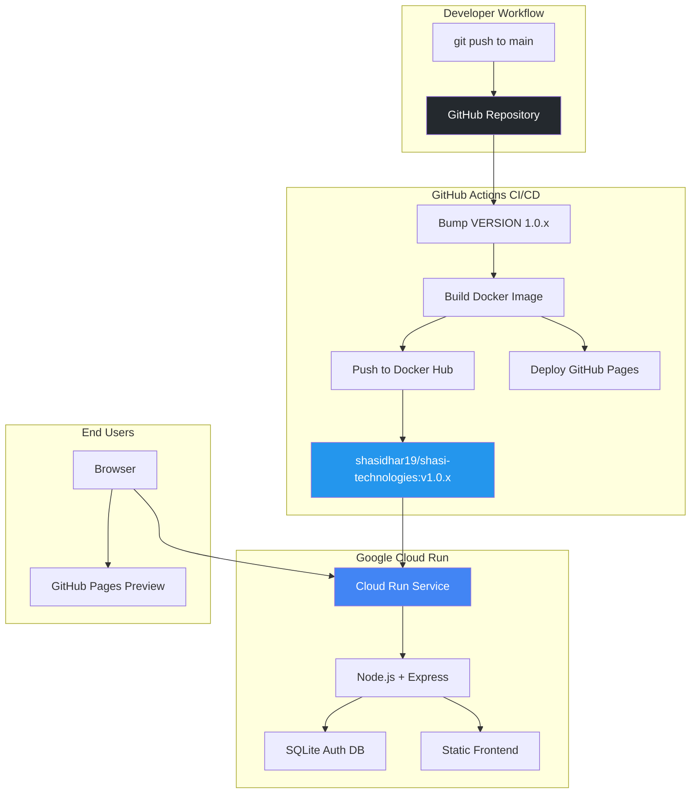
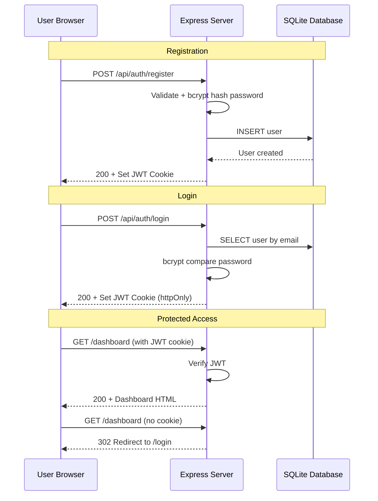

# 🚀 Shasi Technologies — Deployment Guide

Complete step-by-step guide to run, build, containerize, and deploy the Shasi Technologies platform.

---

## Table of Contents

1. [Prerequisites](#1-prerequisites)
2. [Local Development](#2-local-development)
3. [Docker — Build & Run Locally](#3-docker--build--run-locally)
4. [Push to Docker Hub](#4-push-to-docker-hub)
5. [Deploy to Google Cloud Run](#5-deploy-to-google-cloud-run)
6. [Deploy via gcloud CLI (Docker Hub Image)](#6-deploy-via-gcloud-cli-docker-hub-image)
7. [GitHub Actions CI/CD — Auto Versioning + Docker Push](#7-github-actions-cicd--auto-versioning--docker-push)
8. [GitHub Pages — Static Preview](#8-github-pages--static-preview)
9. [Custom Domain Setup](#9-custom-domain-setup)
10. [Environment Variables Reference](#10-environment-variables-reference)
11. [Troubleshooting](#11-troubleshooting)
12. [Architecture Diagram](#12-architecture-diagram)

---

## 1. Prerequisites

Install these tools before starting:

| Tool | Version | Install Command | Verify |
|---|---|---|---|
| **Node.js** | 20+ | `brew install node` or [nodejs.org](https://nodejs.org) | `node --version` |
| **npm** | 10+ | Bundled with Node.js | `npm --version` |
| **Docker** | 24+ | `brew install --cask docker` or [docker.com](https://docs.docker.com/get-docker/) | `docker --version` |
| **Git** | 2.40+ | `brew install git` | `git --version` |
| **gcloud CLI** | Latest | `brew install --cask google-cloud-sdk` or [cloud.google.com/sdk](https://cloud.google.com/sdk/docs/install) | `gcloud --version` |
| **gh CLI** | Latest | `brew install gh` | `gh --version` |

### Accounts Required

| Service | URL | Purpose |
|---|---|---|
| **Docker Hub** | [hub.docker.com](https://hub.docker.com) | Container image registry |
| **Google Cloud** | [console.cloud.google.com](https://console.cloud.google.com) | Cloud Run hosting |
| **GitHub** | [github.com](https://github.com) | Source code + CI/CD |

---

## 2. Local Development

### Step 1 — Clone the repository

```bash
git clone https://github.com/ShasidharReddy/Shasi-CaaS.git
cd Shasi-CaaS
```

### Step 2 — Install server dependencies

```bash
cd server
npm install
```

Expected output:
```
added 85 packages in 4s
```

### Step 3 — Start the development server

```bash
node index.js
```

Expected output:
```
Shasi Technologies running on port 8080
```

### Step 4 — Open in browser

```
http://localhost:8080          → Landing page (public)
http://localhost:8080/login    → Login page
http://localhost:8080/register → Register page
```

### Step 5 — Test the auth flow

```bash
# Register a new user
curl -X POST http://localhost:8080/api/auth/register \
  -H "Content-Type: application/json" \
  -d '{"username":"admin","email":"admin@shasi.dev","password":"Admin@1234"}'

# Expected output:
# {"user":{"id":1,"username":"admin","email":"admin@shasi.dev","role":"admin","created_at":"..."}}

# Login (saves JWT cookie)
curl -c cookies.txt -X POST http://localhost:8080/api/auth/login \
  -H "Content-Type: application/json" \
  -d '{"email":"admin@shasi.dev","password":"Admin@1234"}'

# Expected output:
# {"user":{"id":1,"username":"admin","email":"admin@shasi.dev","role":"admin",...}}

# Access protected page (with cookie)
curl -b cookies.txt -o /dev/null -w "Status: %{http_code}\n" \
  http://localhost:8080/dashboard
# Expected: Status: 200

# Access protected page (without cookie)
curl -o /dev/null -w "Status: %{http_code}\n" \
  http://localhost:8080/dashboard
# Expected: Status: 302 (redirect to login)

# Cleanup
rm cookies.txt
```

### Step 6 — Stop the server

Press `Ctrl+C` in the terminal.

---

## 3. Docker — Build & Run Locally

### Step 1 — Start Docker Desktop

Make sure Docker Desktop is running:

```bash
docker info
# Should show Server Version, Storage Driver, etc.
```

### Step 2 — Build the container image

```bash
# From repo root
cd Shasi-CaaS
docker build -t shasi-technologies:latest .
```

Expected output:
```
[+] Building 12.3s (10/10) FINISHED
 => [1/5] FROM node:20-alpine
 => [2/5] WORKDIR /app
 => [3/5] COPY server/package*.json ./
 => [4/5] RUN npm ci --production
 => [5/5] COPY server/ ./ && COPY src/ ./public/
 => exporting to image
 => => naming to docker.io/library/shasi-technologies:latest
```

### Step 3 — Run the container

```bash
docker run -d \
  --name shasi-tech \
  -p 8080:8080 \
  -e JWT_SECRET="your-secret-key-change-in-production" \
  shasi-technologies:latest
```

### Step 4 — Verify it's running

```bash
# Check container status
docker ps

# Expected:
# CONTAINER ID   IMAGE                      STATUS         PORTS
# abc123         shasi-technologies:latest   Up 5 seconds   0.0.0.0:8080->8080/tcp

# Test the endpoint
curl -o /dev/null -w "Status: %{http_code}\n" http://localhost:8080/
# Expected: Status: 200

# Check logs
docker logs shasi-tech
# Expected: Shasi Technologies running on port 8080
```

### Step 5 — Stop and remove the container

```bash
docker stop shasi-tech
docker rm shasi-tech
```

---

## 4. Push to Docker Hub

### Step 1 — Login to Docker Hub

```bash
docker login -u shasidhar19
# Enter your Docker Hub password or access token when prompted
# Expected: Login Succeeded
```

### Step 2 — Tag the image

```bash
VERSION=$(cat VERSION)
echo "Current version: $VERSION"

docker tag shasi-technologies:latest shasidhar19/shasi-technologies:${VERSION}
docker tag shasi-technologies:latest shasidhar19/shasi-technologies:latest
```

### Step 3 — Push to Docker Hub

```bash
docker push shasidhar19/shasi-technologies:${VERSION}
docker push shasidhar19/shasi-technologies:latest
```

Expected output:
```
The push refers to repository [docker.io/shasidhar19/shasi-technologies]
abc123: Pushed
def456: Pushed
1.0.0: digest: sha256:... size: 1234
```

### Step 4 — Verify on Docker Hub

```bash
docker pull shasidhar19/shasi-technologies:latest
```

Or visit: https://hub.docker.com/r/shasidhar19/shasi-technologies

---

## 5. Deploy to Google Cloud Run

### Step 1 — Create a GCP project

```bash
# Login to GCP
gcloud auth login

# Create project (skip if exists)
gcloud projects create shasi-technologies --name="Shasi Technologies"

# Set as active project
gcloud config set project shasi-technologies

# Enable required APIs
gcloud services enable \
  run.googleapis.com \
  cloudbuild.googleapis.com \
  artifactregistry.googleapis.com
```

### Step 2 — Enable billing

Go to [console.cloud.google.com/billing](https://console.cloud.google.com/billing) → link a billing account to the project.

> ⚠️ Cloud Run free tier: 2M requests/month, 360K vCPU-seconds, 180K GiB-seconds.

### Step 3 — Push image to Artifact Registry

```bash
# Create Artifact Registry repository
gcloud artifacts repositories create shasi-tech \
  --repository-format=docker \
  --location=us-central1 \
  --description="Shasi Technologies container images"

# Configure Docker authentication
gcloud auth configure-docker us-central1-docker.pkg.dev

# Tag for Artifact Registry
PROJECT_ID=$(gcloud config get-value project)
docker tag shasi-technologies:latest \
  us-central1-docker.pkg.dev/${PROJECT_ID}/shasi-tech/shasi-technologies:latest

# Push
docker push us-central1-docker.pkg.dev/${PROJECT_ID}/shasi-tech/shasi-technologies:latest
```

### Step 4 — Deploy to Cloud Run

```bash
PROJECT_ID=$(gcloud config get-value project)

gcloud run deploy shasi-technologies \
  --image us-central1-docker.pkg.dev/${PROJECT_ID}/shasi-tech/shasi-technologies:latest \
  --region us-central1 \
  --platform managed \
  --allow-unauthenticated \
  --port 8080 \
  --memory 512Mi \
  --cpu 1 \
  --min-instances 0 \
  --max-instances 5 \
  --set-env-vars "NODE_ENV=production,JWT_SECRET=$(openssl rand -hex 32)"
```

Expected output:
```
Deploying container to Cloud Run service [shasi-technologies]
in project [shasi-technologies] region [us-central1]

✓ Deploying... Done.
  ✓ Creating Revision...
  ✓ Routing traffic...

Service [shasi-technologies] revision [shasi-technologies-00001-abc]
has been deployed and is serving 100% of traffic.

Service URL: https://shasi-technologies-abc123-uc.a.run.app
```

### Step 5 — Verify the deployment

```bash
# Get the service URL
SERVICE_URL=$(gcloud run services describe shasi-technologies \
  --region us-central1 --format 'value(status.url)')

echo "Live at: $SERVICE_URL"

# Test it
curl -o /dev/null -w "Status: %{http_code}\n" $SERVICE_URL
# Expected: Status: 200
```

---

## 6. Deploy via gcloud CLI (Docker Hub Image)

If you prefer deploying the Docker Hub image directly:

```bash
gcloud run deploy shasi-technologies \
  --image docker.io/shasidhar19/shasi-technologies:latest \
  --region us-central1 \
  --platform managed \
  --allow-unauthenticated \
  --port 8080 \
  --memory 512Mi \
  --set-env-vars "NODE_ENV=production,JWT_SECRET=$(openssl rand -hex 32)"
```

---

## 7. GitHub Actions CI/CD — Auto Versioning + Docker Push

The pipeline auto-triggers on every push to `main`.

### Pipeline Flow

```
Push to main
    ↓
Read VERSION file (e.g., 1.0.0)
    ↓
Bump patch → 1.0.1
    ↓
Commit VERSION + create git tag v1.0.1
    ↓
Build Docker image
    ↓
Push to Docker Hub:
  • shasidhar19/shasi-technologies:1.0.1
  • shasidhar19/shasi-technologies:latest
```

### Setup — Add GitHub Secrets

Go to **repo → Settings → Secrets and variables → Actions → New repository secret**:

| Secret Name | Value | Where to get it |
|---|---|---|
| `DOCKERHUB_USERNAME` | `shasidhar19` | Your Docker Hub username |
| `DOCKERHUB_TOKEN` | `dckr_pat_xxxx...` | Docker Hub → [Account Settings → Security → New Access Token](https://hub.docker.com/settings/security) |

### Set secrets via CLI

```bash
# Set Docker Hub username
gh secret set DOCKERHUB_USERNAME -R ShasidharReddy/Shasi-CaaS
# When prompted, enter: shasidhar19

# Set Docker Hub access token
gh secret set DOCKERHUB_TOKEN -R ShasidharReddy/Shasi-CaaS
# When prompted, paste your Docker Hub access token
```

### Verify the workflow after merging a PR

```bash
# List recent workflow runs
gh run list -R ShasidharReddy/Shasi-CaaS --limit 5

# Watch a specific run live
gh run watch -R ShasidharReddy/Shasi-CaaS

# Check version tags
git fetch --tags
git tag --list 'v*' --sort=-v:refname | head -5
```

---

## 8. GitHub Pages — Static Preview

GitHub Pages auto-deploys the `src/` directory as a static preview (no auth, landing page only).

**Live URL**: https://shasidharreddy.github.io/Shasi-CaaS/

> ℹ️ Pages shows the public landing page only. Login/auth features require Docker or Cloud Run deployment.

---

## 9. Custom Domain Setup

### Option A — Cloud Run direct domain mapping

```bash
# Map your domain
gcloud beta run domain-mappings create \
  --service shasi-technologies \
  --domain shasi.dev \
  --region us-central1

# Get DNS records to add at your registrar
gcloud beta run domain-mappings describe \
  --domain shasi.dev \
  --region us-central1
```

Add the provided DNS records (CNAME or A/AAAA) at your domain registrar.

### Option B — Cloud Run + Global Load Balancer (production)

For SSL termination, CDN, and WAF:

```bash
# 1. Create a serverless NEG
gcloud compute network-endpoint-groups create shasi-neg \
  --region=us-central1 \
  --network-endpoint-type=serverless \
  --cloud-run-service=shasi-technologies

# 2. Create backend service
gcloud compute backend-services create shasi-backend \
  --global --load-balancing-scheme=EXTERNAL_MANAGED

# 3. Add NEG to backend
gcloud compute backend-services add-backend shasi-backend \
  --global \
  --network-endpoint-group=shasi-neg \
  --network-endpoint-group-region=us-central1

# 4. Create URL map
gcloud compute url-maps create shasi-lb \
  --default-service shasi-backend

# 5. Create Google-managed SSL certificate
gcloud compute ssl-certificates create shasi-cert \
  --domains=shasi.dev --global

# 6. Create HTTPS proxy
gcloud compute target-https-proxies create shasi-https \
  --ssl-certificates=shasi-cert --url-map=shasi-lb

# 7. Create forwarding rule
gcloud compute forwarding-rules create shasi-frontend \
  --global --target-https-proxy=shasi-https --ports=443
```

---

## 10. Environment Variables Reference

| Variable | Default | Required in Prod | Description |
|---|---|---|---|
| `PORT` | `8080` | No | Server listen port |
| `NODE_ENV` | `development` | Yes | Set to `production` for deployments |
| `JWT_SECRET` | Dev default | **Yes** | Secret for JWT signing. Generate: `openssl rand -hex 32` |

### Update env vars on Cloud Run

```bash
gcloud run services update shasi-technologies \
  --region us-central1 \
  --set-env-vars "JWT_SECRET=$(openssl rand -hex 32)"
```

---

## 11. Troubleshooting

### Container won't start

```bash
# Check logs
docker logs shasi-tech

# Rebuild without cache
docker build --no-cache -t shasi-technologies .
```

### Port already in use

```bash
# Find what's using port 8080
lsof -i :8080

# Run on a different port
docker run -p 3000:8080 shasi-technologies:latest

# Or locally
PORT=3000 node server/index.js
```

### Database errors / reset user data

```bash
# SQLite database is at data/users.db
# To reset:
rm -rf data/
node server/index.js   # auto-creates fresh DB

# Inside Docker:
docker exec -it shasi-tech rm -rf /app/data
docker restart shasi-tech
```

### Cloud Run 403 / permission denied

```bash
# Make service publicly accessible
gcloud run services add-iam-policy-binding shasi-technologies \
  --region us-central1 \
  --member="allUsers" \
  --role="roles/run.invoker"
```

### GitHub Actions failing

```bash
# Check if secrets are configured
gh secret list -R ShasidharReddy/Shasi-CaaS

# View workflow logs
gh run view <RUN_ID> --log -R ShasidharReddy/Shasi-CaaS

# Re-run a failed workflow
gh run rerun <RUN_ID> -R ShasidharReddy/Shasi-CaaS
```

### JWT token expired / invalid

- Clear browser cookies and re-login
- Check server logs: `docker logs shasi-tech 2>&1 | grep -i "jwt\|token\|auth"`
- JWT tokens expire after 24 hours by default

---

## 12. Architecture Diagram





---

## Quick Reference Cheat Sheet

```bash
# ──── LOCAL ────
cd Shasi-CaaS/server && npm install && node index.js
# → http://localhost:8080

# ──── DOCKER ────
docker build -t shasi-technologies .
docker run -d -p 8080:8080 --name shasi-tech shasi-technologies
# → http://localhost:8080

# ──── DOCKER HUB ────
docker login -u shasidhar19
docker tag shasi-technologies shasidhar19/shasi-technologies:$(cat VERSION)
docker push shasidhar19/shasi-technologies:$(cat VERSION)
docker push shasidhar19/shasi-technologies:latest

# ──── CLOUD RUN ────
gcloud run deploy shasi-technologies \
  --image shasidhar19/shasi-technologies:latest \
  --region us-central1 --platform managed \
  --allow-unauthenticated --port 8080

# ──── VERSION CHECK ────
cat VERSION
git tag --list 'v*' --sort=-v:refname | head -1
```
